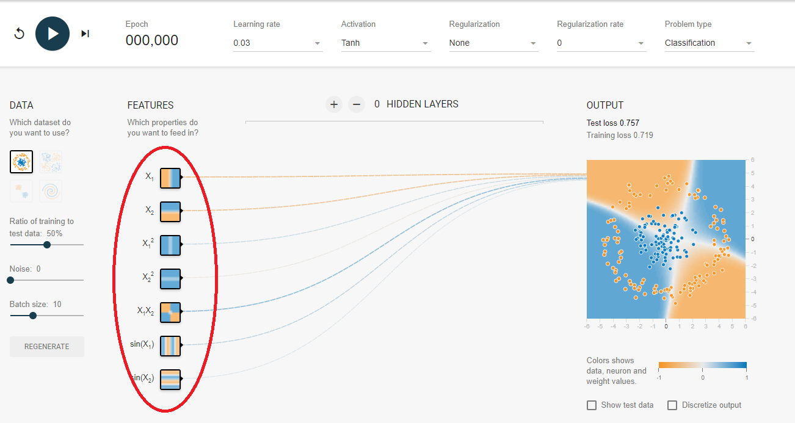
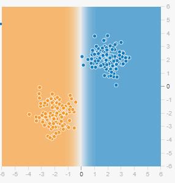
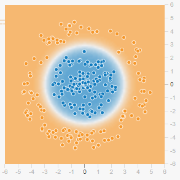
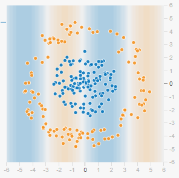
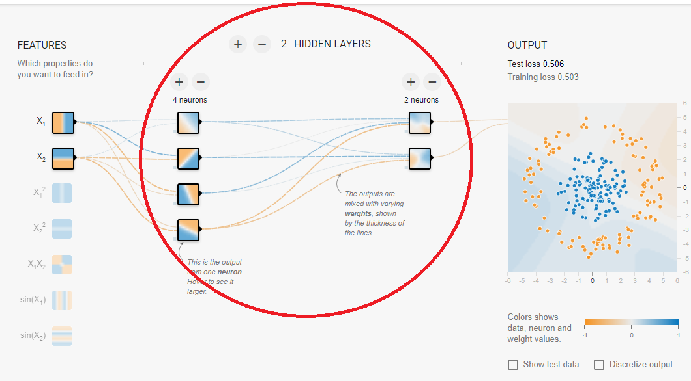

# PRÁCTICA DE REDES NEURONALES

Para realizar esta práctica se usará la página ["A Neuronal Network Playground"](http://playground.tensorflow.org/). 

["A Neuronal Network Playground"](http://playground.tensorflow.org/) es una página web que emula el comportamiento de una red neuronal ante una serie de variables de entrada, "input variables" y muestra visualmente su estado. Este programa tiene como fin acotar una serie de datos en el espacio que les corresponde en el plano. Para ello, el usuario debe hacer uso de los input necesarios así como de las capas de neuronas correspondientes para clasificar **los puntos naranjas en las regiones naranjas y los azules en las regiones azules**.

### Variable de entrada:

Los input de entrada son funciones que emplea el usuario para clasificar los datos en diferentes regiones. Las variables de entrada vienen definidas en la parte izquierda del programa: 

#### Ejemplos de input:

**Función X1 y X2:**

X1 y X2 son funciones que crean un **línea recta** de separación de los resultados.

**Función X1^2 y X2^2:**

X1^2 y X2^2 son funciones cuadráticas que crean **curvas** de separación de los resultados.

**Función X1X2:**

La función X1X2 es la función resultante de multiplicar dos funciones lineales formando un conjunto que da la opción de **dividir en 4 regiones diferentes** el plano de resultados de manera inmediata.

**Función Sin (X1) y Sin(X2):**

La función sin(X1) divide el plano de soluciones en **múltiples regiones de manera alterna**.

  

### Capas neuronales:

La red neuronal es un sistema formado por una serie de capas que el usuario puede utilizar para ajustar las función de entrada al campo de datos deseado. Para ello, las neuronas modifican la forma de la función de entrada y de esta manera, el programa selecciona la cantidad de deformación que cada neurona ejerce sobre la función para que esta pueda acotar el espacio deseado.

 Cada capa tendrá que incorporar un mínimo de dos neuronas porque incorporar tan solo una sería igual que conectar la variable de entrada a la de salida.

Veamos el siguiente ejemplo:

Queremos acotar una serie de puntos formados de manera circular. Dentro del círculo estarían los puntos azules mientras que fuera tendríamos los puntos naranjas . Introduciendo x1 y x2 como input (función de entrada) tan solo podríamos acotar los puntos de manera lineal y por tanto la solución del problema sería imposible. 

Si introducimos una capa de tan solo dos neuronas observamos que la línea recta que acota los puntos toma forma curva. Las neuronas “doblan” la recta que forman las variables de entrada.

Introduciendo una neurona más en la capa, el plano se podrá doblar de manera que forme un círculo y por tanto el programa podrá acotar la nube de puntos.

## PRÁCTICA

### Ejercicio 0:
Pruebe a realizar el ejemplo mencionado anteriormente.

  a)	¿Qué pasaría al añadir más neuronas a la capa??
  
  b)	¿Qué número de neuronas acota mejor el espacio de datos?
  
  c)	Añada una capa más a la red neuronal. En la primera capa coloque 5 neuronas y en la segunda tan solo dos. Ejecute el programa. ¿nota alguna diferencia al sumarle una capa de dos neuronas?
  Ahora intercambien el número de neuronas, establezca 2 en la primera capa y 5 en la segunda, ¿qué podemos observar? 

### Ejercicio 1

Consiga clasificar los datos “Exclusive Or” con el mínimo número de neuronas posibles empleando la función de entrada que prefiera.

a) ¿Cuál es el número mínimo de neuronas?

b) usando como input X1 y X2, ¿Cuántas capas y neuronas usaría?

c) ¿es posible clasificar estos datos usando tan solo funciones de entrada X1^2, X2^2, sin (X1) y sin(X2)?

### Ejercicio 2

Ejercicio 2

Consiga clasificar los datos “Gaussianos” con el mínimo número de neuronas posibles empleando la función de entrada que prefiera.

a) ¿Cuál es el número mínimo de neuronas?

b) ¿Es posible clasificar estos datos usando tan solo como funciones de entrada X1^2, X2^2, sin (X1) y sin(X2)?

c)¿Qué conclusión podría extraer del ejercicio 1 y 2?

### Ejercicio 3

Empleando todas las funciones de entrada posibles al mismo tiempo clasifique una nube de puntos en forma de espiral. ¿Cuántas capas ha usado? ¿Cuál es el número máximo de capas que se pueden emplear y en cada una de ellas se usan 8 neuronas?

